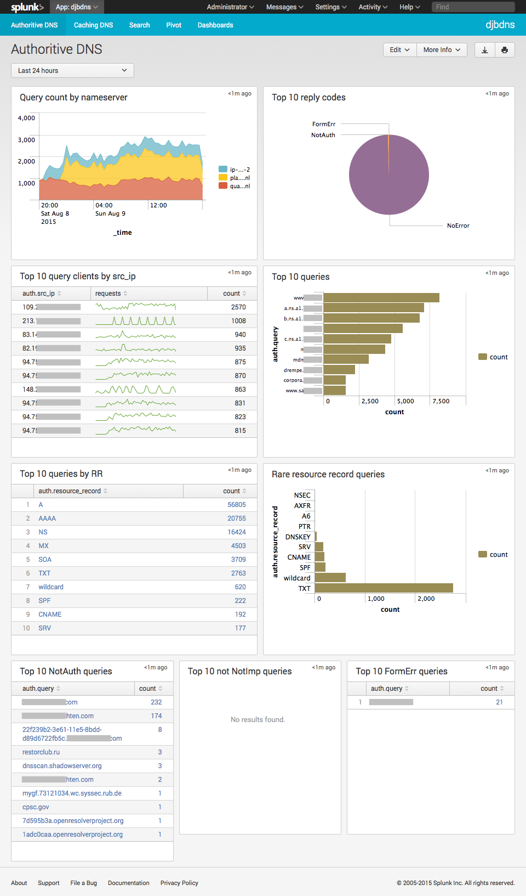
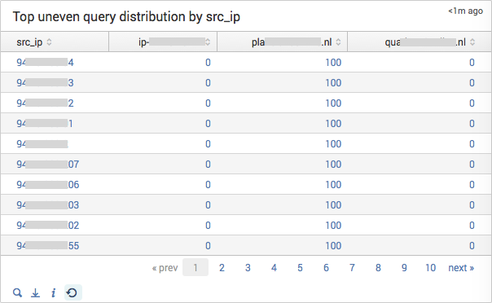
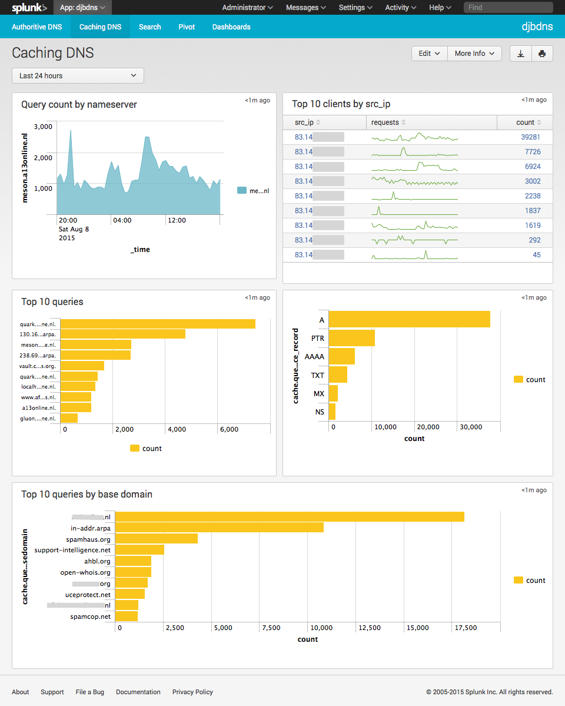

# Splunk TA for djbdns

This Splunk TA provides search knowledge into the log files from following DNS
components by djb:

* tinydns
* axfrdns
* dnscache

The search knowledge is captured in a single datamodel, from which various
panels are built through the Splunk pivot tool. It covers the log files from
the original djbdns v1.05, or any newer patched version that uses the djb
daemontools for logging.

## Installation

1. Install this Splunk TA on your indexer(s), or manually create index(es) called "dns"
2. Install this Splunk TA on your search head to get the authoritive and caching dns dashboards,
3. Install this Splunk TA on your deployment server, or manually create apps with the appropriate inputs.conf

    ````
    cd $SPLUNK_HOME/etc/deployment-apps`
    git clone https://github.com/jorritfolmer/splunk_ta_djbdns.git
    ````

    * Enable the inputs on the deployment server by setting `disabled = 0` in `$SPLUNK_HOME/etc/deployment-apps/splunk_ta_djbdns/default/inputs.conf`
    * `/opt/splunk/bin/splunk reload deploy-server`
    * Create a serverclass (e.g. `djbdns`) on the deployment-server
    * Assign this app to the serverclass
    * Assign clients the serverclass

## Configuration

None necessary, but feel free to poke around.

## Splunk data models and CIM compliance

This Splunk TA is compatible with Splunk Enterprise 6.2+, and uses data models exclusively. 
It provides 1 data model with 2 childs:

* dns
    * auth (for tinydns/axfrdns log entries)
    * cache (for dnscache log entries)

The data model provides fields compatible with the Splunk Common Information Model (CIM):

* src_ip
* src_port
* transport (not available for dnscache)
* transaction_id
* query
* reply_code
* reply_code_id

And the following non CIM-compliant field:

* resource_record

## Authoritive Dashboard



Shows the top src_ips that don't evenly distribute their queries to each available nameserver:



## Caching Dashboard



