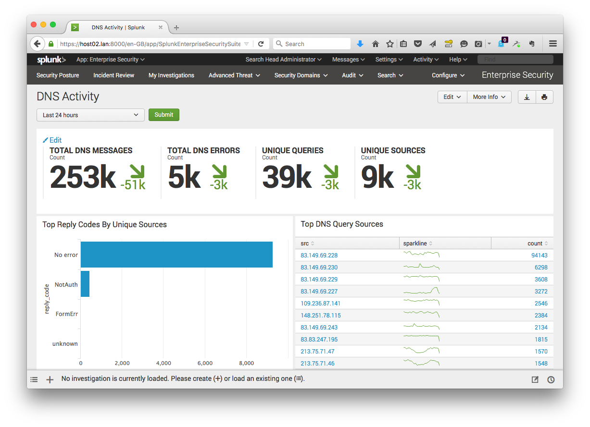

# TA-djbdns for Splunk 

This CIM compliant TA can be used with Splunk Enterprise Security and
provides field extractions, aliases, eventtypes and tags for the following DNS
components by djb:

* tinydns
* axfrdns
* dnscache

It covers the log files from the original djbdns v1.05, or any newer patched
version that uses the djb daemontools for logging.

After installation, the DNS Activity panel under Protocol Intelligence in
Splunk Enterprise Security will look like this:



## Installation

Install this TA on your Splunk (Enterprise Security) search head. Make
sure to rename it Splunk_TA_djbdns or TA-djbdns otherwise ES won't eat it.

## Configuration 

Have the log files indexed by a Splunk Universal Forwarder with sourcetypes
`axfrdns`, `tinydns` or `dnscache`. For example with the following inputs.conf:

```
[monitor:///etc/tinydns/log/main/current]
disabled = false
sourcetype = tinydns
index=dns

[monitor:///etc/dnscache/log/main/current]
disabled = false
sourcetype = dnscache
index=dns

[monitor:///etc/axfrdns/log/main/current]
disabled = false
sourcetype = axfrdns
index=dns
```

## CIM 

The TA provides fields compatible with the Splunk Common Information Model (CIM):

* message_type
* src_ip
* src_port
* transport (not available for dnscache)
* transaction_id
* query_type
* query
* reply_code
* reply_code_id

And the following non CIM-compliant field:

* resource_record

